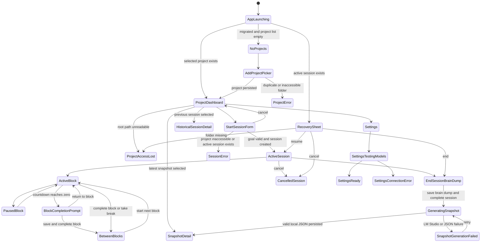

# Working Memory Snapshot - App State And Dependency Map

**Date:** 2026-06-28
**Status:** Design reference for M8/M9 UI review and 9b two-column implementation

## Purpose

This document enumerates the application states implied by the current SwiftUI implementation, the product specs, and the supplied M8-style visual references. It is meant to support design review and future implementation without changing product scope.

The companion static mockups live at:

```text
docs/mockups/app-state-mockups.html
```

The mockups use a two-column exploration model:

```text
project sidebar -> single workspace
```

This file began as a static design artifact. Branch `9b-two-column-app-structure` converts the production SwiftUI shell from three columns to this two-column model while preserving the same data, observation, and LM Studio boundaries.

## Grounding Rules

- The source of truth is the local SQLite data model, repository contracts, view-model state, and local LM Studio API boundary.
- The screenshots are visual guidance for layout, density, hierarchy, and calm tone.
- The active-session mockup intentionally shows review copy such as "Focus Block 2 of 4" and "2 of 4 blocks" to explore hierarchy. The current data model stores `block_index`, status, timing, intention, and summary, but does not store a target block count for a session. Production UI can truthfully render "Block 2" and "2 blocks completed"; shipping a planned total would require a new explicit product/schema decision.
- Focus blocks are capture points inside a session. They do not end the session automatically, create scores, or enforce breaks. The current implementation names remain `PomodoroBlock`, `PomodoroBlockRepository`, and `pomodoro_blocks`.
- The two-column mockups still treat Focus blocks as first-class state: active and paused block timers, block summaries, manual note/decision/blocker increments, between-block state, historical block timelines, and prompt inclusion are all represented.
- Observed context remains Git, project-relative files, and active applications only. No screenshots, clipboard, browser history, transcripts, keystrokes, or files outside the selected project.

## State Model



## App Shell States

| State | Entry condition | Primary UI | Data dependencies | Service/API dependencies | Exit transitions |
|---|---|---|---|---|---|
| App launching | `ContentView.task` starts | Sidebar and detail may be empty or loading | `schema_migrations`, `projects`, active `sessions`, `app_settings`, Keychain token | `DatabaseMigrator.migrate()`, `ProjectsViewModel.loadProjects()`, `SessionViewModel.loadActiveSessionForRecovery()`, `SettingsViewModel.loadSettings()` | No projects, selected project, recovery sheet, settings |
| No project selected | `selectedItem == nil` or selected project missing | Native unavailable view | `projects` list | None beyond project repository load | Select project, add project, settings |
| No projects | `projects.isEmpty` | Sidebar Projects header with `+`, plus empty-state Add Project action | `projects` table | `NSOpenPanel` when adding | Add project picker |
| Project load error | Migration or repository load throws | Project error alert | Database initialization, migrations, project rows | SQLite through `Database` actor | Dismiss alert, retry by relaunch/reload |
| Settings selected | `selectedItem == .settings` | Workspace settings form | `app_settings`, Keychain token | `SettingsRepository`, `KeychainStore` | Select project, test/refresh/save settings |

## Project States

| State | Entry condition | Primary UI | Data dependencies | Service/API dependencies | Exit transitions |
|---|---|---|---|---|---|
| Add project picker | User activates Projects `+` or Add Project action | Native directory picker | New `Project` defaults to folder name and path | `NSOpenPanel`, `ProjectRepository.createProject(at:)`, SQLite unique `root_path` index | Project dashboard, project error |
| Project dashboard, no sessions | Selected project has no completed sessions | Project header, Start Session, empty previous sessions | `Project`, zero `sessions`, no `snapshots` | `ProjectDetailViewModel.loadLatestSnapshot`, `checkProjectAccess` | Start session form, settings, add project |
| Project dashboard, latest memory | Selected project has a latest snapshot | Resume Brief, Start here, project metrics, Previous Sessions | `projects`, completed `sessions`, `snapshots`, `pomodoro_blocks`, `events` | `SnapshotRepository.latestSnapshot`, `SessionRepository.listSessions`, `PomodoroBlockRepository.listBlocks`, `EventRepository.listEvents` | Start session, view snapshot, select historical session |
| Project dashboard, active session elsewhere | One global active session belongs to another project | Start Session disabled with one-active-session copy | `sessions_single_active_index`, `activeSession.projectID` | `SessionRepository.activeSession()` | End/cancel active session, then start |
| Project access checking | `checkProjectAccess` in flight | Existing dashboard remains visible | `Project.rootPath` | `FileManager.fileExists/isReadableFile` | Accessible or inaccessible |
| Project access lost | Stored root path no longer readable | Access recovery card and disabled Start Session | `Project.rootPath`, project row still persisted | `ProjectRepository.updateProjectRoot(id:to:)`, `NSOpenPanel` | Restore access, settings, select another project |
| Historical session detail | Previous session selected | Session summary, snapshot card, block timeline, observed context | `WorkSession`, optional `Snapshot`, `PomodoroBlock`, `WorkIncrement`, `SessionEvent` | Read-only repositories only | Back to project, view snapshot |
| Cancelled historical session | Selected session status is `cancelled` | Session summary, no snapshot copy | Cancelled `WorkSession`, interrupted block if one existed | Read-only repositories | Back to project |

## Session States

| State | Entry condition | Primary UI | Data dependencies | Service/API dependencies | Exit transitions |
|---|---|---|---|---|---|
| Start session form | `SessionFlow.starting(project.id)` | Goal field, Start Session, Cancel | `Project`, user-facing goal stored as `mission` draft | `SessionRepository.createActiveSession`, `PomodoroBlockRepository.createNextBlock`, access check | Active session, cancel, session error |
| Start session invalid | Empty goal or inaccessible project | Disabled/failed start with error alert | `mission`, `Project.rootPath` | `SessionRepository` validation, `FileManager` | Correct goal/access, cancel |
| Active session with active block | `activeSession != nil`, `activeBlock.status == .active` | Active session, block timer, block summary, increments, observed context | `WorkSession`, `PomodoroBlock`, active block `WorkIncrement`, live `ObservationSessionSummary` | `ObservationCoordinator.startObserving`, FSEvents, Git service, active-app service | Pause, complete block, take break, add increment, end, cancel |
| Block completion prompt | Active block countdown reaches zero | Local notification, app activation, in-app sheet with optional block summary | Existing active `WorkSession` and active `PomodoroBlock`; no alert persistence | `FocusBlockDeadlineAlertService`, `UNUserNotificationCenter`, `NSRunningApplication.activate` | Save and complete block, return to block |
| Active session paused block | `activeBlock.status == .paused` | Paused block card, Resume, Complete Block | `PomodoroBlock.paused_at`, accumulated pause seconds | `PomodoroBlockRepository.resumeBlock` | Resume, complete, end, cancel |
| Between blocks | Active session with no open block | Start next block intention, End Session | Completed/interrupted `pomodoro_blocks`; no active/paused block | `PomodoroBlockRepository.createNextBlock` | Active block, end session |
| Manual increment capture | User adds note, decision, or blocker | Segmented kind picker, title/detail fields | `WorkIncrementKind`, open `PomodoroBlock` | `WorkIncrementRepository.addIncrement` requires active session and active/paused block | Increment row appears, error if no open block |
| End session brain dump | `SessionFlow.ending(session.id)` | Brain dump editor, Generate Snapshot, Return to Session | `WorkSession`, `brainDump` draft | On submit: interrupt open block, stop observation, complete session | Generating snapshot, return active |
| Generating snapshot | `isWorking` during completion/generation | Progress copy: local generation | Completed `WorkSession`, saved brain dump, events, blocks, increments, settings, token | `SnapshotGenerator`, `EvidenceCompactor`, `PromptBuilder`, `LMStudioClient.POST chat/completions` | Snapshot detail, generation failure |
| Snapshot generation failed | Completion saved but `SnapshotGenerator` throws | Dashboard failure card with Retry Snapshot and saved brain dump | Completed `WorkSession.brainDump`, no valid snapshot for session | Failed local model call, invalid model JSON, missing model, unreachable LM Studio | Retry generation, settings |
| Cancel active session | User chooses Cancel Session | No snapshot generated | Active `WorkSession`; open block interrupted | `ObservationCoordinator.stopObservingForCancellation`, `SessionRepository.cancelSession` | Project dashboard, cancelled historical session |

## Recovery States

| State | Entry condition | Primary UI | Data dependencies | Service/API dependencies | Exit transitions |
|---|---|---|---|---|---|
| Recovery sheet, accessible | App launches with active session and readable project root | Modal with project, goal, started time, Resume/End/Cancel | Active `WorkSession`, `Project`, `PomodoroBlock` ensured for legacy sessions | `SessionRepository.activeSession`, `ProjectRepository.project`, `PomodoroBlockRepository.ensureFirstBlock`, `FileManager` | Resume active, end brain dump, cancel |
| Recovery sheet, inaccessible | App launches with active session and missing project root | Modal warning, Resume disabled, Choose Folder Again | Same as above, `isProjectFolderAccessible == false` | `ProjectRepository.updateProjectRoot`, `NSOpenPanel` | Restore then resume/end/cancel |
| Recovered session resumed | User resumes accessible recovery | Active session detail | Existing active session and block list | Observation restarts only after resume | Active block, end, cancel |
| Recovered session ended | User chooses End Session from sheet | Brain dump form | Existing active session | Existing completion/generation flow | Snapshot detail or generation failed |

## Snapshot States

| State | Entry condition | Primary UI | Data dependencies | Service/API dependencies | Exit transitions |
|---|---|---|---|---|---|
| Snapshot detail, generated | `presentedSnapshot != nil` | What changed, Decisions, Open loops, Next action, Resume Brief | `Snapshot`, optional generating `WorkSession` | Read-only `SnapshotRepository` state | Start new session, back to project |
| Snapshot detail, empty arrays | `decisions_json == []` or `open_loops_json == []` | Neutral empty text | Snapshot arrays decoded from JSON | Snapshot repository validation | Back/start new |
| Snapshot detail, placeholder legacy | `generatorModel == PlaceholderSnapshotGenerator.generatorModel` | Generator copy says deterministic placeholder | Legacy `Snapshot.generatorModel` | None | Back/start new |
| Retry-safe replacement | Retry succeeds for a completed session | Latest snapshot updates | `snapshots_session_unique` one snapshot per session | `SnapshotRepository.saveOrReplaceSnapshot` | Snapshot detail/dashboard latest memory |

## Settings And Local API States

| State | Entry condition | Primary UI | Data dependencies | Service/API dependencies | Exit transitions |
|---|---|---|---|---|---|
| Settings idle | Settings detail opened | Base URL, model picker, token, actions | `app_settings`, optional Keychain token | `SettingsRepository.loadLMStudioSettings`, `KeychainStore.loadToken` | Test, refresh, save |
| Settings saved | Save succeeds | "Settings saved." | Normalized base URL, selected model, Keychain token | `SettingsRepository.saveLMStudioSettings`, `KeychainStore.saveToken` | Test, refresh, edit |
| Testing connection | Test/refresh in progress | Progress row | Draft base URL, token | `LMStudioClient.GET {baseURL}/models` | Success or connection error |
| Success with models | Model list returns data | Model picker populated | `models` response IDs | `GET http://localhost:1234/v1/models` by default | Select model, save |
| Invalid base URL | URL normalization fails | Invalid URL message | Draft base URL | `LMStudioURLPolicy.normalizedBaseURL` | Correct URL |
| Server unreachable | LM Studio not running or timed out | Unreachable message and recovery suggestion | Draft base URL/token | `LMStudioClient.listModels` timeout/refusal | Start server, retry |
| Unauthorized | LM Studio rejects token | Auth warning | Optional token from form/Keychain | `Authorization: Bearer <token>` on model/chat requests | Fix token, save/test |
| No models | Server reachable but empty model list | Load model suggestion | Empty `models` response | `GET {baseURL}/models` | Load model, refresh |
| Selected model unavailable | Selected setting not in refreshed list | Model unavailable warning | `selectedModelID`, refreshed `models` | `LMStudioClient.listModels(selectedModelID:)` | Select another model |
| Non-loopback warning | Base URL host is not loopback | Privacy warning before save | Draft base URL | `LMStudioURLPolicy.requiresNonLoopbackWarning` | Save knowingly or restore localhost |
| Chat completion failure | Snapshot generation calls selected model and fails | Snapshot failure card, session preserved | Completed session, settings, token | `POST http://localhost:1234/v1/chat/completions` by default | Retry, settings |

## Data Dependencies By Domain

| Domain | Models/tables | Read paths | Write paths | Important invariant |
|---|---|---|---|---|
| Projects | `Project`, `projects` | Sidebar, dashboard, recovery sheet | Add project, restore root path | `root_path` is unique and defines observation boundary |
| Sessions | `WorkSession`, `sessions` | Recovery, dashboard, detail, history | Start, complete, cancel | One global active session through partial index |
| Blocks | `PomodoroBlock`, `pomodoro_blocks` | Active block, between blocks, history, prompt | Create, pause, resume, complete, interrupt | One active or paused block per session |
| Work increments | `WorkIncrement`, `work_increments` | Active block list, historical detail, prompt | User adds note/decision/blocker | Manual only; attached to blocks |
| Events | `SessionEvent`, `events` | Observed context, prompt digest | Observation coordinator only | Accepted only while a session is active |
| Snapshots | `Snapshot`, `snapshots` | Latest memory, snapshot detail, history | Save/replace after valid generation | One snapshot per completed session |
| Settings | `LMStudioSettings`, `app_settings` | Settings form, snapshot generation | Save base URL/model | Token is never stored in SQLite |
| Keychain | Optional token | Settings load, LM Studio calls | Save/delete token | Token never appears in SQLite/source |

## Service And API Dependencies

| Boundary | Owner | Dependency | States that depend on it |
|---|---|---|---|
| SQLite | `Database`, repositories | Local Application Support database | All persisted app states |
| Migration | `DatabaseMigrator` | Schema versions 1-6 | App launching |
| Folder picker | `ProjectFolderPicker` | `NSOpenPanel` directory selection | Add project, restore access |
| Project access | View models | `FileManager.fileExists`, `isReadableFile` | Start session, dashboard access warning, recovery |
| File observation | `ObservationCoordinator` and `FileObservationService` | FSEvents scoped to project root | Active session only |
| Git evidence | `GitService`, `ProcessRunner` | `/usr/bin/git` argument arrays | Active session start/end |
| Active app evidence | `ActiveAppObservationService` | `NSWorkspace` activation notifications | Active session only |
| Focus block alerts | `FocusBlockDeadlineAlertService` | `UserNotifications`, AppKit activation | Active block deadline only |
| Evidence compaction | `EvidenceCompactor` | Bounded deterministic digest | Snapshot generation |
| Prompt construction | `PromptBuilder` | Prompt version `v1`, JSON schema boundary | Snapshot generation |
| Local model API | `LMStudioClient` | `GET {baseURL}/models`, `POST {baseURL}/chat/completions` | Settings, snapshot generation |
| Token storage | `KeychainStore` | macOS Keychain | Settings, local model calls |

## Local API Route Contracts

The app has no backend and no cloud API. "Routing" is split between SwiftUI navigation and LM Studio local HTTP calls.

### SwiftUI route state

This table describes the current app implementation. The production shell now collapses these destinations into one visual workspace column.

| Route owner | State | Detail destination |
|---|---|---|
| `ProjectsViewModel.selectedItem` | `.project(projectID)` | Project workspace route |
| `ProjectsViewModel.selectedItem` | `.settings` | Settings workspace |
| `ProjectDetailViewModel.presentedSnapshot` | Non-nil | `SnapshotDetailView` |
| `SessionViewModel.flow` | `.starting(projectID)` | `StartSessionView` |
| `SessionViewModel.flow` | `.ending(sessionID)` | `EndSessionView` |
| `SessionViewModel.activeSession` | Matches selected project | `ActiveSessionView` |
| `ProjectDetailViewModel.selectedSessionID` | Non-nil | `HistoricalSessionDetailView` |
| Default | None of the above | `ProjectDashboardView` |

### LM Studio HTTP routes

| Action | HTTP route | Request owner | Required local data | Success output | Failure surfaced as |
|---|---|---|---|---|---|
| Refresh/test models | `GET {baseURL}/models` | `LMStudioClient.listModels` | Base URL, optional token | `[LMStudioModel]` | Settings connection state |
| Generate snapshot | `POST {baseURL}/chat/completions` | `LMStudioClient.generateSnapshot` | Selected model, prompt, JSON schema, optional token | `SnapshotGenerationResult` | Session error plus retry card |

Default resolved routes:

```text
GET  http://localhost:1234/v1/models
POST http://localhost:1234/v1/chat/completions
```

## Mockup Inventory

The companion HTML mockups cover these states:

1. Empty library and no projects.
2. Add project folder picker.
3. Project dashboard with latest memory and no active session.
4. Start session form.
5. Active session with active focus block.
6. Paused block.
7. Between blocks after completing a block or taking a break.
8. End-session brain dump and local generation.
9. Snapshot generation failure with retry.
10. Snapshot detail.
11. Historical session detail with blocks and observed context.
12. Recovery sheet with accessible project folder.
13. Recovery sheet with missing project folder.
14. Project folder access lost.
15. Settings ready/success.
16. Settings connection problems.

States not shown as full screens in the mockup file are represented in the tables above when they are native alerts, transient loading states, or data-only variations of a rendered screen.

All session-related mockups retain the Focus block layer instead of flattening it into generic session metadata.
